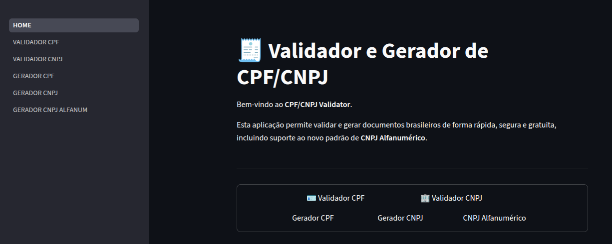

# CPF/CNPJ Validator

Aplicação web desenvolvida com Streamlit para validação e geração de documentos brasileiros. O projeto oferece suporte a CPF, CNPJ tradicional e ao novo padrão de CNPJ alfanumérico, seguindo as regras oficiais de cálculo dos dígitos verificadores.

## Funcionalidades

### Validação de documentos

- Validação de CPF
- Validação de CNPJ numérico
- Validação de CNPJ alfanumérico
- Remoção automática de caracteres de formatação
- Verificação dos dígitos verificadores

### Geração de documentos

- Geração de CPF válido
- Geração de CNPJ numérico válido
- Geração de CNPJ alfanumérico válido

## Tecnologias Utilizadas

- Python 3
- Streamlit
- Docker
- Docker Compose

## Estrutura do Projeto

```text
.
├── .dockerignore
├── .gitignore
├── Dockerfile
├── README.md
├── docker-compose.yaml
├── requirements.txt
└── src
    ├── App.py
    ├── pages
    │   ├── 1_Validador_CPF.py
    │   ├── 2_Validador_CNPJ.py
    │   ├── 3_Gerador_CPF.py
    │   ├── 4_Gerador_CNPJ.py
    │   └── 5_Gerador_CNPJ_ALFANUM.py
    └── utils
        ├── cnpj.py
        └── cpf.py
```

### Organização dos Arquivos

| Arquivo | Descrição |
|----------|------------|
| `src/HOME.py` | Página inicial da aplicação |
| `src/pages/1_Validador_CPF.py` | Interface para validação de CPF |
| `src/pages/2_Validador_CNPJ.py` | Interface para validação de CNPJ |
| `src/pages/3_Gerador_CPF.py` | Interface para geração de CPF |
| `src/pages/4_Gerador_CNPJ.py` | Interface para geração de CNPJ numérico |
| `src/pages/5_Gerador_CNPJ_ALFANUM.py` | Interface para geração de CNPJ alfanumérico |
| `src/utils/cpf.py` | Implementação das regras de CPF |
| `src/utils/cnpj.py` | Implementação das regras de CNPJ |

## Execução Local

### 1. Clone o repositório

```bash
git clone https://github.com/seu-usuario/cpf-cnpj-validator.git
cd cpf-cnpj-validator
```

### 2. Crie um ambiente virtual

**Linux/macOS**

```bash
python -m venv .venv
source .venv/bin/activate
```

**Windows**

```powershell
python -m venv .venv
.venv\Scripts\activate
```

### 3. Instale as dependências

```bash
pip install -r requirements.txt
```

### 4. Execute a aplicação

```bash
streamlit run src/HOME.py
```

A aplicação estará disponível em:

```text
http://localhost:8501
```

## Executando com Docker

### Construir a imagem

```bash
docker build -t cpf-cnpj-validator .
```

### Executar o container

```bash
docker run --rm -it -p 8501:8501 cpf-cnpj-validator
```

## Executando com Docker Compose

Subir a aplicação:

```bash
docker compose up --build
```

Executar em segundo plano:

```bash
docker compose up -d --build
```

Encerrar os serviços:

```bash
docker compose down
```

## Algoritmos Implementados

### CPF

- Remoção de caracteres não numéricos
- Verificação do comprimento do documento
- Rejeição de sequências repetidas
- Cálculo dos dois dígitos verificadores

### CNPJ

- Suporte ao CNPJ numérico tradicional
- Suporte ao CNPJ alfanumérico
- Cálculo dos dígitos verificadores conforme especificação oficial
- Tratamento automático de caracteres de formatação

## Objetivo

Este projeto foi desenvolvido com fins educacionais e de demonstração técnica, servindo como referência para implementação dos algoritmos de validação e geração de documentos brasileiros utilizando Python e Streamlit.


## Capturas de Tela

### Página Inicial

<p align="center">
    
</p>